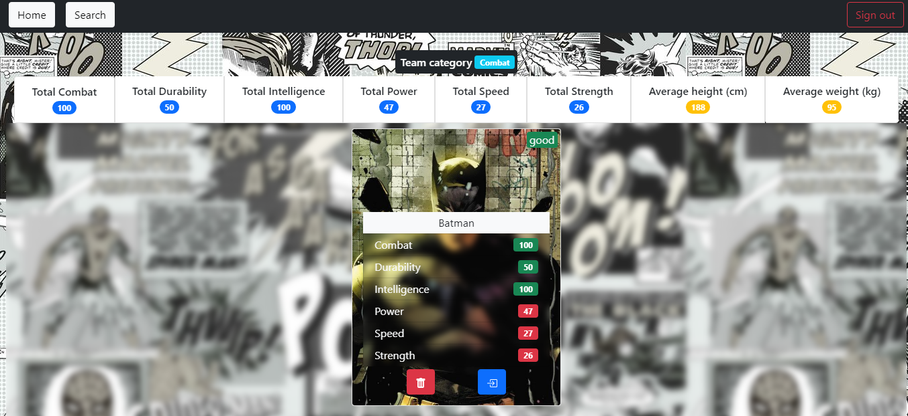

# Super Héroe #Alkemy

Con esta aplicación podremos crear nuestro propio equipo de superhéroes, y tendremos a disposición datos sobre el mismo, así como sus estadísticas, su nivel individual y grupal.
También tendremos un apartado de búsqueda donde podremos encontrar a nuestro superhéroe favorito y agregarlo a nuestro equipo.

## Instalación

- Clonar el repositorio `git clone https://github.com/facuNorie/SuperHero-Alkemy.git`
- Instalar las dependencias `npm install`
- Correr el proyecto `npm run dev`

## Login

Para tener acceso a la aplicación se requiere de las siguientes credenciales.

- email: challenge@alkemy.org
- password: react

## Búsqueda de héroes

Una vez logeados, podremos buscar y agregar a nuestro equipo a nuestros héroes favoritos.

## Nuestro equipo

Una vez agregados nuestros héroes al equipo, veremos algo como esto:

## Detalles del equipo

También podremos ver los detalles de cada uno de nuestros héroes y las estadísticas de ellos y del equipo completo.

